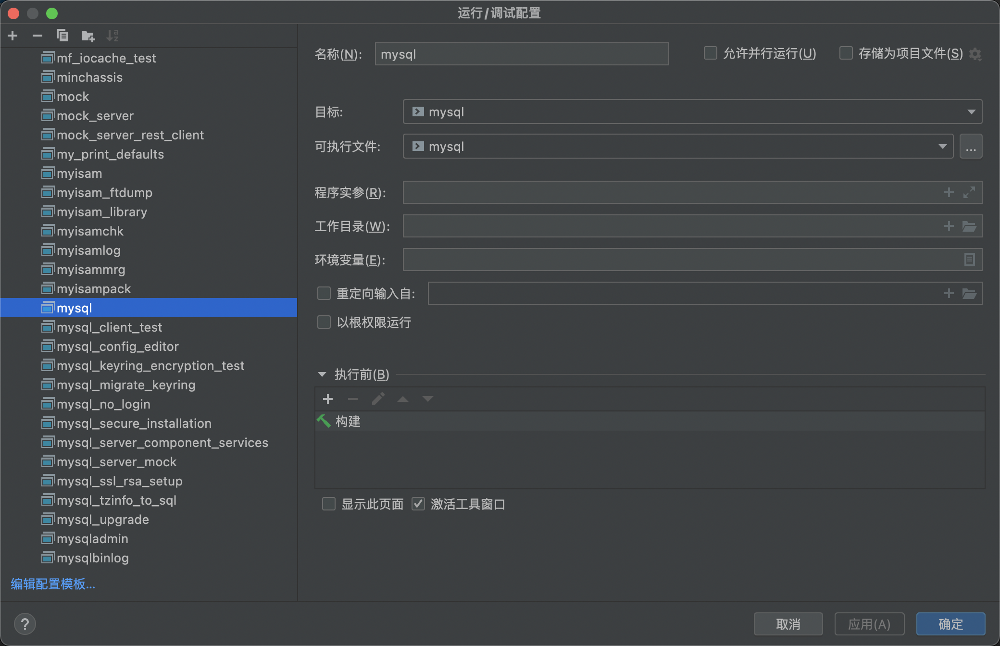

## 环境

> Mac OS (m1) 
>
> Clion
>
> MySQL 8.0 源码 https://github.com/mysql/mysql-server
>
> MySQL 8.0 boost_1_73_0 依赖，源码安装

### Boost 下载安装

最新版并不是MySQL需要的，MySQL 8.0 默认需要的是boost_1_73_0，如果版本不符合要求，编译启动过程中会有相应的提示。

https://www.boost.org/users/history/version_1_73_0.html

https://www.boost.org/doc/libs/1_73_0/more/getting_started/unix-variants.html

正常来说下载，解压到指定目录即可，这里我们把boost解压到 `/usr/local/` 目录下 ，追加 BOOST_ROOT 到 PATH 环境变量。


### 下载 MySQL-Server 源码

`git clone git@github.com:mysql/mysql-server.git`

## Clion 配置Debug

### 用Clion打开MySQL Server 源码工程，配置cmake


Cmake 配置如下：

```shell
-DWITH_DEBUG=1 
-DWITH_BOOST=/usr/local/boost_1_73_0
```

### 运行Cmake


## Debug MySQL Server

### 选择 MySQL Server 启动入口


需要配置MySQL Server的相关目录，更多配置项 https://dev.mysql.com/doc/refman/8.0/en/data-directory-initialization.html

```shell
--basedir=/Users/timmy/mysql 
--datadir=/Users/timmy/mysql/data
```

然后点击Debug即可，如果我们本地安装有mysql client，这时候就可以通过客户端免密登录了。

```shell
mysql -u root --skip-password
```


### 选择配置 MySQL 指令，在clion中连接启动的mysqld （本地有mysql客户端可以不用）



